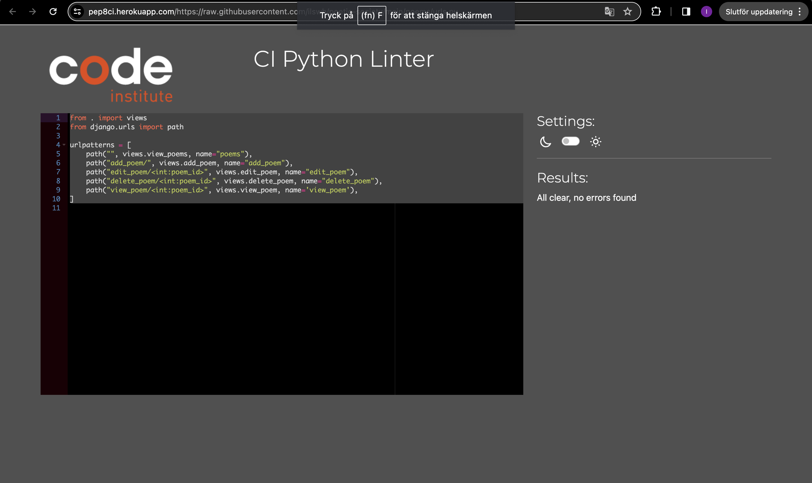
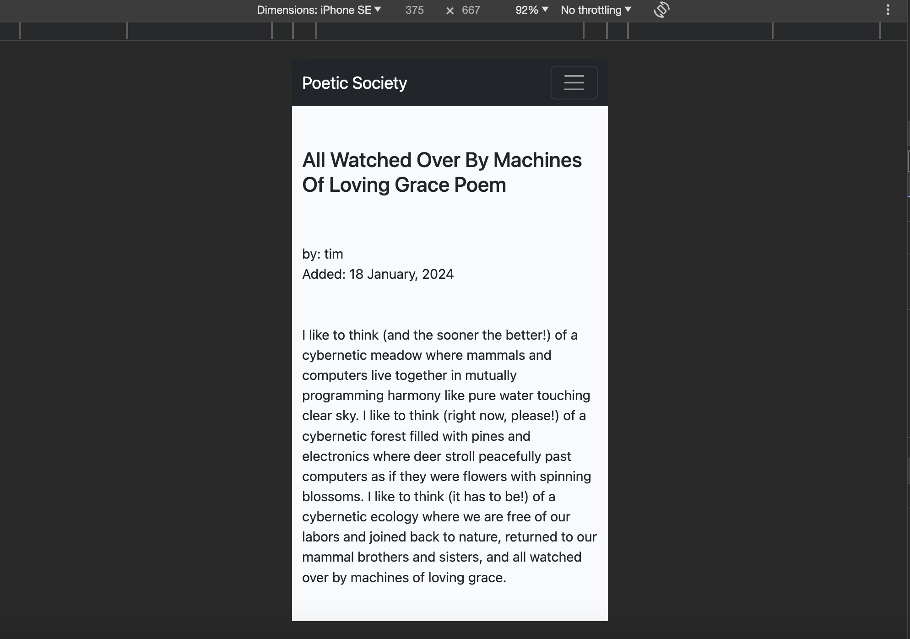
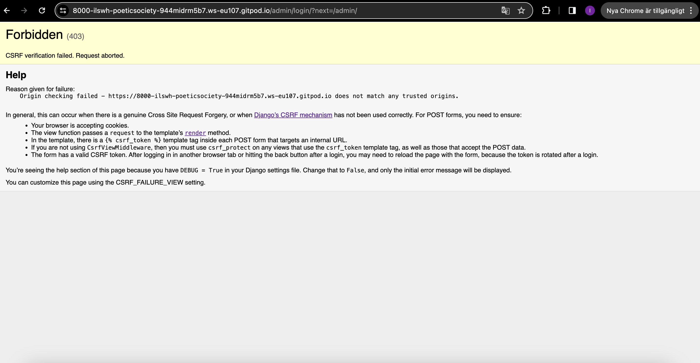

# Testing

Return back to the [README.md](README.md) file.

All features of Poetic Society have been tested through:
- Code validation of HTML, CSS, Python
- Browser compatability in Chrome, Firefox and Opera
- Responsiveness on mobile, tablet and desktop
- Lighthouse
- Defensive programming
-  User stories

## Code Validation

All files in Poetic Society have been validated through HTML, CSS and Python validators.

### HTML

I have used the recommended [HTML W3C Validator](https://validator.w3.org) to validate all of my HTML files.

| Page | W3C URL | Screenshot | Notes |
| --- | --- | --- | --- |
| Home | [W3C](https://validator.w3.org/nu/?doc=https://poetic-society-f2599d0af047.herokuapp.com/) |  | Pass: No Errors |
| View Poem | [W3C](https://validator.w3.org/nu/?doc=https://poetic-society-f2599d0af047.herokuapp.com/view_poem/2) |  | Pass: No Errors |
| Register | [W3C](https://validator.w3.org/nu/?doc=https://poetic-society-f2599d0af047.herokuapp.com/accounts/signup/) |  | See under bugss 
| Login | [W3C](https://validator.w3.org/nu/?doc=https://poetic-society-f2599d0af047.herokuapp.com/accounts/login/) |  | Pass: No Errors |
| Contact |  [W3C](https://validator.w3.org/nu/?doc=https://poetic-society-f2599d0af047.herokuapp.com/contact) |  | Pass: No Errors |

### CSS

I have used the recommended [CSS Jigsaw Validator](https://jigsaw.w3.org/css-validator) to validate all of my CSS files.

| File | Jigsaw URL | Screenshot | Notes |
| --- | --- | --- | --- |
| style.css | [Jigsaw](https://jigsaw.w3.org/css-validator/validator?uri=https%3A%2F%2Fpoetic-society-f2599d0af047.herokuapp.com) |  | Bootstrap |

### Python

I have used the recommended [PEP8 CI Python Linter](https://pep8ci.herokuapp.com) to validate all of my Python files.

| File | CI URL | Screenshot | Notes |
| --- | --- | --- | --- |
| manage.py | [PEP8 CI](https://pep8ci.herokuapp.com/https://raw.githubusercontent.com/ilswh/poetic-society/main/manage.py) |  | Pass: No Errors |
| main-settings.py | [PEP8 CI](https://pep8ci.herokuapp.com/https://raw.githubusercontent.com/ilswh/poetic-society/main/main/settings.py/) |  | Pass: No Errors |
| main-urls.py | [PEP8 CI](https://pep8ci.herokuapp.com/https://raw.githubusercontent.com/ilswh/poetic-society/main/main/urls.py) |  | Pass: No Errors |
| contact-admin.py | [PEP8 CI](https://pep8ci.herokuapp.com/https://raw.githubusercontent.com/ilswh/poetic-society/main/contact/admin.py) |  | Pass: No Errors |
|contact-forms.py | [PEP8 CI](https://pep8ci.herokuapp.com/https://raw.githubusercontent.com/ilswh/poetic-society/main/contact/forms.py) |  | Pass: No Errors |
|contact-models.py | [PEP8 CI](https://pep8ci.herokuapp.com/https://raw.githubusercontent.com/ilswh/poetic-society/main/contact/models.py) |  | Pass: No Errors |
|contact-urls.py | [PEP8 CI](https://pep8ci.herokuapp.com/https://raw.githubusercontent.com/ilswh/poetic-society/main/contact/urls.py) |  | Pass: No Errors |
|contact-views.py | [PEP8 CI](https://pep8ci.herokuapp.com/https://raw.githubusercontent.com/ilswh/poetic-society/main/contact/views.py) |  | Pass: No Errors |
|poems-admin.py | [PEP8 CI](https://pep8ci.herokuapp.com/https://raw.githubusercontent.com/ilswh/poetic-society/main/poems/admin.py) |  | Pass: No Errors |
|poems-forms.py | [PEP8 CI]( https://pep8ci.herokuapp.com/https://raw.githubusercontent.com/ilswh/poetic-society/main/poems/forms.py) |  | Pass: No Errors |
|poems-models.py | [PEP8 CI](https://pep8ci.herokuapp.com/https://raw.githubusercontent.com/ilswh/poetic-society/main/poems/models.py) |  | Pass: No Errors |
|poems-urls.py | [PEP8 CI]( https://pep8ci.herokuapp.com/https://raw.githubusercontent.com/ilswh/poetic-society/main/poems/urls.py) |  | Pass: No Errors |
|poems-views.py | [PEP8 CI](https://pep8ci.herokuapp.com/https://raw.githubusercontent.com/ilswh/poetic-society/main/poems/views.py) |  | Pass: No Errors |

## Browser Compatibility

I have tested the browser compatability in the three browsers below.

- [Chrome](https://www.google.com/chrome)
- [Firefox (Developer Edition)](https://www.mozilla.org/firefox/developer)
- [Opera](https://www.opera.com/download)

I've tested my deployed project on multiple browsers to check for compatibility issues.

| Browser | Home | View Poem | Registrate | Login | Add Poem | Logout | Contact | Notes |
| --- | --- | --- | --- | --- | --- | --- | --- | --- |
| Chrome |  |  |  |  |  |   |   | Works as expected |
| Firefox |  |  |  |  |  |   |   | Works as expected |
| Opera |  |  |  |  |  |   |   | Works as expected |

## Responsiveness

I've tested my deployed project on multiple devices to check for responsiveness issues.

| Device | Home | View Poem | Register | Login | Add Poem | Logout | Contact | Notes |
| --- | --- | --- | --- | --- | --- | --- | --- | --- |
| Mobile (DevTools) |  |  |  |  |   |   |  | Works as expected |
| Tablet (DevTools) |  |  |  |  |   |   |  | Works as expected |
| Desktop |  |  |  |  |  |   |   | Works as expected |

## Lighthouse Audit

I've tested my deployed project using the Lighthouse Audit tool to check for any major issues.

| Page | Mobile | Desktop | Notes |
| --- | --- | --- | --- |
| Home |  |  | Some minor warnings |
| View Poem |  |  | Some minor warnings |
| Register |  |  | Some minor warnings |
| Login |  |  | Some minor warnings |
| Add Poem |  |  | Some minor warnings |
| Logout |  |  | Some minor warnings |

## Defensive Programming

PP3 (Python-only):
- Users must enter a valid letter/word/string when prompted
MS3 (Flask) | MS4/PP4/PP5 (Django):
- Standard users should not be able to access pages intended for superusers

Defensive programming was manually tested with the below user acceptance testing:

| Page | Expectation | Test | Result | Fix | Screenshot |
| --- | --- | --- | --- | --- | --- |
| View Poem | | | | | |
| | Feature is expected to open poem when clicking on a chosen one | Tested the feature by doing clicking on poem | The feature behaved as expected, and it did open the clicked poem | Test concluded and passed |  |
| Register | | | | | |
| | Feature is expected to do open a registration form when the user clicks on register in the nav-bar  | Tested the feature by clicking on register in the nav-bar | The feature behaved as expected, and it did open the form | Test concluded and passed |  |
| | Feature is expected to registrate a new member and log in when the user fills in their chosen username, password and email | Tested the feature by filling in information | The feature behaved as expected, and successfully logged in as user | Test concluded and passed |  |
| Login | | | | | |
| | Feature is expected to do open a login form when the user clicks on login in the nav-bar  | Tested the feature by clicking on login in the nav-bar | The feature behaved as expected, and it did open a form | Test concluded and passed |  |
| | Feature is expected to login when the user fills in username, password and clicks on signin | Tested the feature by doing filling in the information and clicking sign in | The feature behaved as expected, and it successfully logged in user | Test concluded and passed |  |
| Add Poem | | | | | |
| | Feature is expected to do open a form to add a poem when the registered user clicks on add poem in the nav-bar  | Tested the feature by clicking on contact in the nav-bar | The feature behaved as expected, and it did open a form | Test concluded and passed |  |
| | Feature is expected to add a poem to the site when user fills in a title, poem and clicks on add poem | Tested the feature by doing filling in information and clicking add poem | The feature behaved as expected, and it did add the poem | Test concluded and passed |  |
| Edit Poem | | | | | |
| | Feature is expected to do open a form to edit poem when the registered user clicks on edit poem on one of their poems | Tested the feature by clicking on edit poem on logged in users added poem | The feature behaved as expected, and it did open the form | Test concluded and passed |  |
| | Feature is expected to show the edited poem to the site when user changes the title or poem and clicks on edit poem | Tested the feature by doing filling in information and clicking edit poem | The feature behaved as expected, and it did add the poem | Test concluded and passed |  |
| | Feature is expected to deny editing poem and redirect to view poem when user is logged out | Tested the feature by logging out then pasting edit_poem over view_poem in browser | The feature behaved as expected, and it did denied acccess | Test concluded and passed |  |
| Delete Poem | | | | | |
| | Feature is expected to do open a popup which says "Are you sure you want to delete this poem?" with the options "Yes" and "No" when the registered user clicks on delete poem on one of their poems | Tested the feature by clicking on "Delete Poem" on logged in users added poem | The feature behaved as expected, and it did open the form | Test concluded and passed |  |
| | Feature is expected to not delete the poem when the user clicks "No" and go back to viewing the poem | Tested the feature by doing clicking on no | The feature behaved as expected, and it did not delete the poem and went back to viewing the poem when user chose "No" | Test concluded and passed |  |
| | Feature is expected to deny deleting poem and redirect to view poem when user is logged out | Tested the feature by logging out then pasting delete_poem over view_poem in browser | The feature behaved as expected, and it did denied acccess | Test concluded and passed |  |
| | Feature is expected to delete the poem when the user clicks "Yes" | Tested the feature by doing clicking on "Yes" | The feature behaved as expected, and it did logout when user chose "Yes" | Test concluded and passed |  |
| Logout | | | | | |
| | Feature is expected to do open a logout page when the user clicks on logout in the nav-bar  | Tested the feature by clicking on logout in the nav-bar | The feature behaved as expected, and it did open the page for the logout procedure | Test concluded and passed |  |
| | Feature is expected to logout and show the message "You Have Signed Out." when the user clicks "Sign Out" | Tested the feature by doing clicking on "Sign Out" | The feature behaved as expected, and it did logout and show the message when user clicked "Sign Out" | Test concluded and passed |  |
| Contact | | | | | |
| | Feature is expected to do open a contact form when the user clicks on contact in the nav-bar  | Tested the feature by clicking on contact in the nav-bar | The feature behaved as expected, and it did open a form | Test concluded and passed |  |
| | Feature is expected to say "Thank for the message!" when the user has filled in the boxes of name, email, message  | Tested the feature by clicking on contact in the nav-bar | The feature behaved as expected, and it did say "Thank for the message!" | Test concluded and passed |  |

OR

| | Feature is expected to do X when the user does Y | Tested the feature by doing Y | The feature did not respond to A, B, or C. | I did Z to the code because something was missing |  |

## User Story Testing

| User Story | Screenshot |
| --- | --- |
| As a new site user, I would like to view poems, so that I can enjoy poetry. |   |
| As a new site user, I would like to registrate as user, so that I can share poems on the site. |   |
| As a returning user, I would like to view poems, so that I can enjoy poetry. |   |
| As a returning site user, I would like to login, so that I can share poems. |  |
| As a returning site user, I would like to add poems, so that I can share my poems. |  |
| As a returning site user, I would like to edit my poems, so that I can correct spellings or improve my text. |  |
| As a returning site user, I would like to delete poems, so that I can secure posting my poem. |  |
| As a returning site user, I would like to logout, so that I can feel calm and secure. |  |
| As a site administrator, I should be able to add poems, so that I can share poems. |  |
| As a site administrator, I should be able to edit poems, so that I can correct spelling or improve text. |  |
| As a site administrator, I should be able to delete poems, so that I can keep the site as I want. |  |

## Automated Testing

I have conducted a series of automated tests on my application.

I fully acknowledge and understand that, in a real-world scenario, an extensive set of additional tests would be more comprehensive.

#### Unit Test Issues

## Bugs

-  `'include is not defined'` when trying to runserver.

    

    - To fix this, I made the code shorter and easier for me to comprehend.

      

-  `missing destination file operand` after message

    

    - To fix this, I added the name destination file.

-  `CSRF verification failed` 

    

    - To fix this, I added the gitpod link to trusted origins in settings.py

    

### GitHub **Issues**

https://github.com/ilswh/poetic-society/issues

**Fixed Bugs**

All previously closed/fixed bugs can be tracked [here](https://github.com/ilswh/poetic-society/issues?q=is%3Aissue+is%3Aclosed).

| Bug | Status |
| --- | --- |
| [`include is not defined` when trying to runserver.](https://github.com/ilswh/poetic-society/issues/11) | Closed |
| [`missing destination file operand` after message](https://github.com/ilswh/poetic-society/issues/12) | Closed |
| [`CSRF verification failed`](https://github.com/ilswh/poetic-society/issues/13) | Closed |

**Open Issues**

Any remaining open issues can be tracked [here](https://github.com/ilswh/poetic-society/issues).

| Bug | Status |
| --- | --- |
| [register.html valdidation failed](https://github.com/ilswh/poetic-society/issues/14) | Open |
| [style.css valdidation failed](https://github.com/ilswh/poetic-society/issues/15) | Open |

## Unfixed Bugs

- Django-allauth has a known bug with the signup form. It adds 
 tags within another block element, and causes HTML validation errors from W3C:.

    

    - I have not yet attempted to fix this.

- Parse error.

    

    - I have not yet attempted to fix this because it is bootstrap.

There are no remaining bugs that I am aware of.
